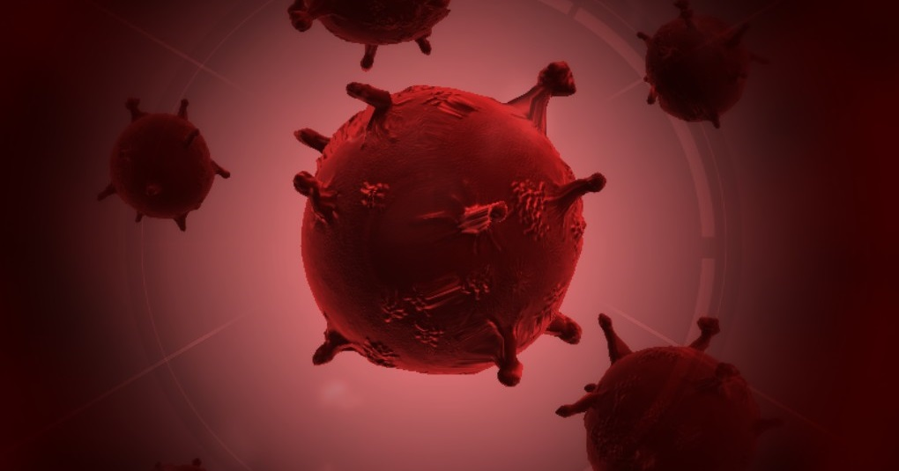

## Entrega 2 - ORM HIBERNATE

## Cambios desde el TP anterior

Se identificaron una serie de cambios necesarios a hacerse sobre la prueba de concepto anterior:
La capa de persistencia deberá cambiarse para utilizar Hibernate/JPA en lugar de JDBC.
**Nota:** No es necesario que mantengan los test y funcionalidad utilizando JDBC.

## Funcionalidad

Nuevamente nos reunimos con el equipo de científicos, los cuales nos informan de varias características que serán necesarias representar en nuestra simulación. 

  

Además de lo que ya sabíamos, nos cuentan que cada Patogeno tiene ciertos atributos que la caracterizan.

### Atributos

- Capacidad de contagio, que puede ser por persona, animales o insectos.
- Defensa contra otros micro-organismos
- Letalidad, qué tan peligroso es para el infectado.

Cada uno de estas atributos representa con un valor numérico del 1 al 100.

## Mutaciones

  

Muy profesionalmente, los científicos nos llevan a una sala de proyectores en la cual a través de unos slides, profundizan contándonos más sobre las especies, las cuales nos interesan por su capacidad de mutar y potenciarse.

Una mutación es una nueva habilidad que incrementa el valor numérico de uno de los atributos de la especie.

Una Especie puede mutar utilizando ADN. Cada mutación tiene un número de puntos de ADN que la especie tiene que gastar para conseguirla.

Así mismo, cada nueva mutación permite desbloquear nuevas mutaciones que la especie potencialmente podría desarrollar, de tener suficiente ADN para adquirirlas.

El científico que les está compartiendo esta información se toma unos segundos para comentarles que es importante que tengan en cuenta que una mutación particular puede tener como requerimiento una combinación de varias mutaciones previas.

## ADN
Una especie obtendra 1 de ADN cada 5 personas infectadas

### Vectores

  

Luego de las proyecciones y un café de por medio, son dirigidos a un laboratorio.
Aqui, les enseñan que un patógeno se esparce a través de vectores biológicos, que son los agentes que transportan y transmiten un patógeno a otro organismo vivo. Estos pueden ser Humanos, Animales, o Insectos.

### Ubicacion

Los vectores pueden moverse de ubicación en ubicación.
Toda ubicación tendrá un nombre que deberá ser único.

### Contagio

Un vector podrá poner en riesgo de contagio a otro vector respetando las siguientes normas:

- Un humano puede ser contagiado por otro humano, un insecto o un animal.
- Un animal solo puede ser contagiado por un insecto.
- Un insecto solo puede ser contagiado por un humano o un animal.

La probabilidad que un contagio de un vector a otro sea exitoso se resolverá de la siguiente forma.
Tiene como base un número entre el 1 y el 10
A Este número se le suma el atributo de contagio de la especie relacionado al vector que se está intentando infectar  
Esto se traduce a:

`porcentajeDeContagioExitoso = (random(1, 10)) + factorContagio`

Con este porcentaje, deberá determinarse si el contagio fue exitoso o no. Si lo fue, el nuevo vector pasa de estar Sano a estar Infectado.

**Nota:** Un vector puede estar infectado por varias especies de patógenos.

## DTO

Una vez terminadas las charlas con los cientificos, el lider tecnico se acerca y nos comenta sobre grandes avances que estuvo realizando el equipo de Frontend los cuales ya poseen una interfaz semi-funcional lista como prototipo. Dado que ellos ya poseen una implementacion de este concepto de negocio, nos comenta que se nos va a proveer un DTO (Data Transfer Object) que encapsula la representacion de datos que el equipo de frontend estan utilizando, y nos pide que una vez implementado este concepto en el backend proveamos la funcionalidad que transforme esa representacion en una que se maneje el backend.

## Servicios

Se pide que implementen los siguientes servicios los cuales serán consumidos por el frontend de la aplicación.

### VectorService 

- `Create Read Delete de vectores`

- `contagiar(vectorInfectado : Vector, vectores: List<Vector>)` El vector infectado intentara contagiar a los otros vectores. 
	**Nota:** Un vector intentara contagiar una vez a cada otro vector por cada especie con la que este infectado

- `infectar(vector: Vector, especie: Especie)`  Se infecta al vector con la especie

- `enfermedades(vectorId: Int): List<Especie> `  Dado un vector retorna todas las especies que esta padeciendo. 

### UbicacionService

- `Create Read  de lugares`

- `mover(vectorId: Int, nombreDeLaUbicacion: String)` Mueve un vector de la ubicación en la que se encontraba a una nueva. Si el vector está infectado, intentara contagiar a todos los vectores presentes en la nueva locación. **Nota:** Leer VectorService.

- `expandir( nombreDeLaUbicacion: String)` Dada una ubicacion, debera tomar un vector contagiado **elegido al azar**. Ese vector debe intentar contagiar a todos los otros vectores presentes en el mismo lugar. De no haber ningun vector contagiado en el lugar, no hace nada. **Nota:** Leer VectorService

### MutacionService

- `Create Read  de Mutaciones`

- `mutar(especieId: Int, mutacionId: Int)` Muta la especie. Recordar que para mutar, la especie debe cumplir con los requerimientos de la mutación.

### PatogenoService

- `Create Read de Patogenos y Especies`

- `agregarEspecie(id: Int, nombreEspecie: String, nombreDeLaUbicacion: String) : Especie` - Debera lograr que se genere una nueva Especie del Patogeno. 

- `cantidadDeInfectados(especieId: Int ): Int` devuelve la cantidad de vectores infectados por la especie 

- `esPandemia(especieId: Int): Boolean` Devuelve true si la especie se encuentra presente más de la mitad de todas las locaciones disponibles

### EstadisticaService

- `especieLider(): Especie` retorna la especie que haya infectado a más humanos

- `lideres(): List<Espceie>` retorna las diez primeras especies que hayan infecatado la mayor cantidad total de vectores humanos y animales combinados en orden descendente.

- `reporteDeContagios(nombreDeLaUbicacion: String): ReporteDeContagios` Dada una ubicacion, debera retornar un objeto reporte que contenga
	- La cantidad de vectores presentes.
	- Cantidad de vectores infectados.
	- Nombre de la especie que esta infectando a mas vectores.

### Se pide:

- Que provean implementaciones para las interfaces descriptas anteriormente.

- Que modifiquen el mecanismo de persistencia de Patogeno de forma de que todo el modelo persistente utilice Hibernate.

- Asignen propiamente las responsabilidades a todos los objetos intervinientes, discriminando entre servicios, DAOs y objetos de negocio.

- Provean la implementacion al mensaje "aModelo" de VectorFrontendDTO

- Creen test que prueben todas las funcionalidades pedidas, con casos favorables y desfavorables.

- Que los tests sean deterministicos. Hay mulcha lógica que depende del resultado de un valor aleatorio. Se aconseja no utilizar directamente generadores de valores aleatorios (random) sino introducir una interfaz en el medio para la cual puedan proveer una implementación mock determinística en los tests.

### Recuerden que:
- No pueden modificar las interfaces ya provistas en el TP, solo implementarlas.
- Pueden agregar nuevos métodos y atributos a los objetos ya provistos, pero no eliminar o renombrar atributos / métodos ya provistos.

### Consejos útiles:

- Finalizen los métodos de los services de uno en uno. Que quiere decir esto? Elijan un service, tomen el método más sencillo que vean en ese service, y encarguense de desarrollar la capa de modelo, de servicios y persistencia solo para ese único método. Una vez finalizado (esto también significa testeado), pasen al próximo método y repitan.

- Cuando tengan que persistir con hibernate, analizen:
Qué objetos deben ser persistentes y cuáles no?
Cuál es la cardinalidad de cada una de las relaciones? Como mapearlas?